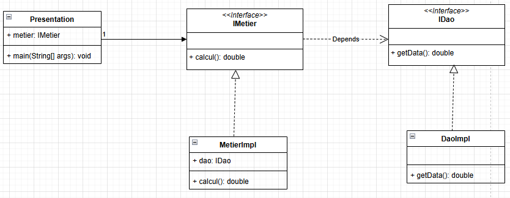
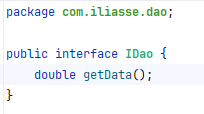
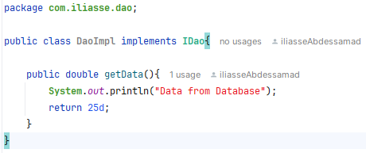
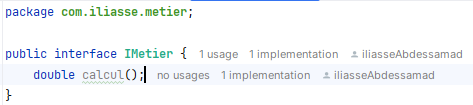
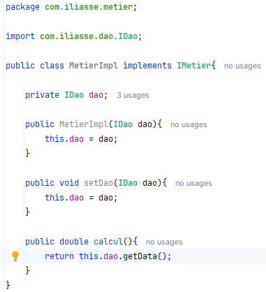

<h2>L'interêt du principe de l'injection de dépendences et de l'inversion de contrôle</h2>
<i>
	L'objectif de ce projet est d'implementer les principes de l'injection de dépendence et de l'inversion de contrôle, et les problèmes
	qui permettent de résoudre
</i>
 

<b>Soit le diagramme de class suivant</b>

 

<b>1 - Création de l'interface IDao</b>

 

<b>2 - Implémentation de l'interface IDao</b>

 

<b>3 - Création de l'interface IMetier</b>

 

<b>4 - Implémentation de l'interface IMetier (en utilisant le couplage faible)</b>

