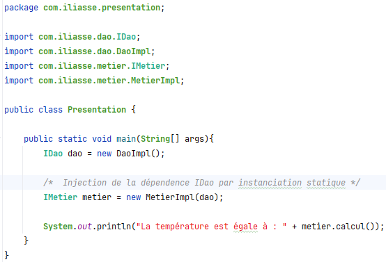
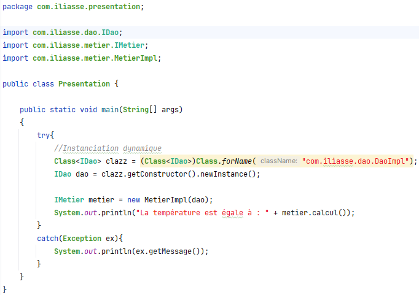
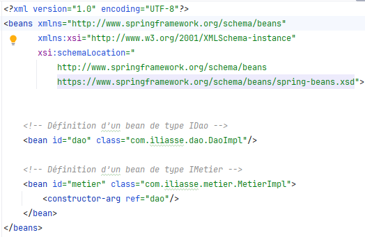
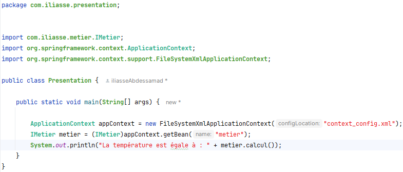
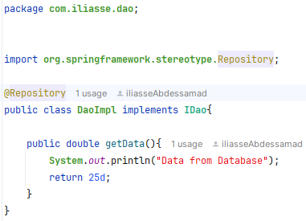
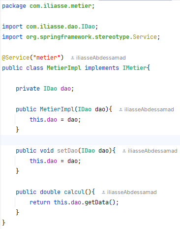
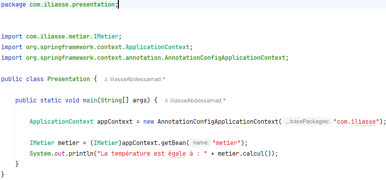

<h2>L'injection de dépendences et de l'inversion de contrôle</h2>
<i>
	L'objectif de ce projet est d'implementer les principes de l'injection de dépendence et de l'inversion de contrôle, et les problèmes
	qui permettent de résoudre
</i>
 

<b>Soit le diagramme de class suivant</b>

 

<b>1 - Création de l'interface IDao</b>

 

<b>2 - Implémentation de l'interface IDao</b>

 

<b>3 - Création de l'interface IMetier</b>

 

<b>4 - Implémentation de l'interface IMetier (en utilisant le couplage faible)</b>

 

<b>5 - L'injection des dépendences</b>

a - Par instanciation statique : 

 

b - Par instanciation dynamique : 

 

c - En utilsant Spring Framework : 

c - 1 - Via un fichier xml de configuration : 

c - 1 - 1 - Voici le fichier de configuration qui permet de configurer le conteneur d'injection des dépendences : 

c - 1 - 2 - Le corps de la méthode main() de la couche presentation 

 

c - 2 - Via l'utilisation des annotations : 

c - 2 - 1 - Configuration du conteneur d'injection de dépendence en utilisant les annotations : 

c - 2 - 2 - Le corps de la méthode main() de la couche presentation 

  
<h3>Conclusion :</h3>

	<b>L'injection de dépendences : </b> est un principe de la programmation orientée objet, qui permet d'établir la dépendence entre 
	les objets via un couplage faible, ce qui permet de créer des applications ouvertes à l'extension et fermées à la modification 
	chose qui facilite l'élaboration des tests unitaires, la maintenance, et l'évolution de l'application.

	<b>L'inversion de contrôle : </b> est un principe de la programmation orientée objet, qui permet en générale à déléguer le flux de 
	l'execution d'un programme (l'aspect technique de l'application) à un framework en utilisant l'injection de dépendance et une 
	configuration de l'application. 
	L'avantage avec ce principe est d'avoir la possibilté d'écrire du code avec une manière déclarative au lieu de l'écrir avec la manière impérative, chose qui permet aux développeurs de ne se concentrer que sur
	l'implémentation des exigences métier de l'application.

